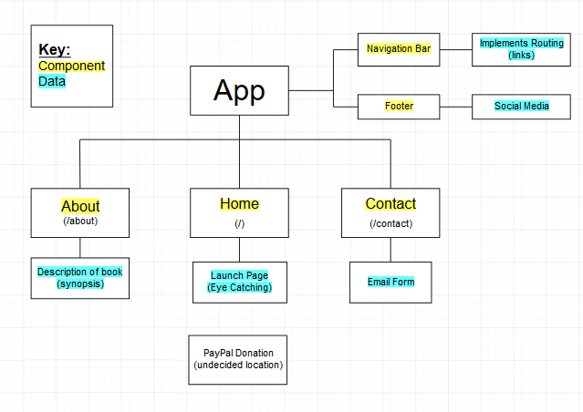

# IROTPlanning

#### _Capstone Planning for Epicdous, 12.07.2018/ 12.14.2018_

#### By _**Kenneth Du**_

## Description

A website for Introspective Rationale: The Odyssey of 
Theodicy by Mitchell G. Thompson 

Links: 

[Amazon](https://www.amazon.com/Introspective-Rationale-Theodicy-Mitchell-Thompson-ebook/dp/B07HCR6QVH/ref=tmm_kin_swatch_0?_encoding=UTF8&qid=1540499014&sr=8-1)

[Barnes and Noble](https://www.barnesandnoble.com/w/introspective-rationale-mitchell-g-thompson/1129541498?ean=9781535615341)

This project was generated with [Angular CLI](https://github.com/angular/angular-cli) version 1.6.5.

[Firebase Test Deploy Link](https://irot-test.firebaseapp.com/)

## Development server

Run `ng serve` for a dev server. Navigate to `http://localhost:4200/`. The app will automatically reload if you change any of the source files.

## Code scaffolding

Run `ng generate component component-name` to generate a new component. You can also use `ng generate directive|pipe|service|class|guard|interface|enum|module`.

## Build

Run `ng build` to build the project. The build artifacts will be stored in the `dist/` directory. Use the `-prod` flag for a production build.

## Running unit tests

Run `ng test` to execute the unit tests via [Karma](https://karma-runner.github.io).

## Running end-to-end tests

Run `ng e2e` to execute the end-to-end tests via [Protractor](http://www.protractortest.org/).

## Further help

To get more help on the Angular CLI use `ng help` or go check out the [Angular CLI README](https://github.com/angular/angular-cli/blob/master/README.md).

## Known Bugs

No known issues

## Support and contact details

_kennethdu3@gmail.com_

## Technologies Used

_Vs Code_
_Git_
_Github_
_HTML_
_Angular 5.2.11_
_Popper.js_
_BootStrap_

### License

This software is licensed under the MIT license.

Copyright (c) 2018 **_Kenneth_Du_**
